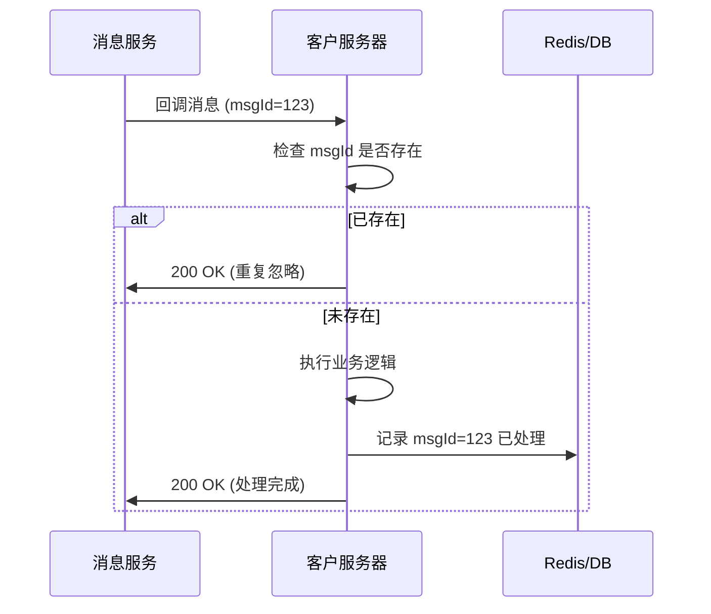

# 消息重复回调处理指南 (Message Deduplication Handling Guide)

## 背景说明
在网络不稳定或弱网环境下，客户端 SDK 可能会为了保证消息可靠送达而重复发送消息（即 *At-least-once Delivery* 语义）。  
因此，您的服务端回调接口可能会收到同一条消息的多次回调。

为避免消息重复入库、重复计费或重复触发业务逻辑，建议在服务端实现去重机制（Deduplication）。

## 去重原理

每条消息在系统中都有一个全局唯一的消息 ID (`msgId`)，  
即使同一条消息被多次发送或回调，这个 `msgId` 都不会变化。

通过在服务端记录已处理过的 `msgId`，可以识别并跳过重复的回调事件。

## 推荐处理逻辑

### 1. 在回调中提取消息 ID

当您的回调服务收到消息时，示例内容如下：

```json
{
  "msgId": "a1b2c3d4e5f6",
  "from": "user_123",
  "to": "user_456",
  "timestamp": 1730000000000,
  "content": "Hello!"
}
````

→ 提取 `msgId` 字段。

### 2. 判断是否已处理过

在执行任何后续操作（例如存库、转发、计费等）之前，
先检查该 `msgId` 是否已经处理过。

建议使用 Redis 或数据库实现快速去重判断。

#### Redis 示例：

```python
def handle_message_callback(event):
    msg_id = event["msgId"]

    # 检查是否处理过
    if redis_client.exists(f"msg_processed:{msg_id}"):
        return {"status": "ignored", "reason": "duplicate"}

    # 标记为已处理，设置过期时间（例如 7 天）
    redis_client.setex(f"msg_processed:{msg_id}", 604800, 1)

    # 执行业务逻辑
    process_message(event)
    return {"status": "ok"}
```

### 3. 设置过期时间（TTL）

为了避免 Redis/数据库数据过大，
建议为每个去重记录设置 TTL（过期时间），如 3–7 天。

TTL 取决于您的消息回调重试周期和保留策略。

### 4. 确保正确返回 ACK

当您的服务端回调接口返回 HTTP 200 OK（或业务定义的成功状态码）时，
系统会认为消息已成功处理。

> 若未返回 200，系统会自动重试回调。
> 因此，请务必保证去重逻辑是幂等的（Idempotent）。

### 5. 流程示意图



## 最佳实践建议

| 类别   | 建议                     |
| ---- | ---------------------- |
| 去重依据 | 使用消息中的 `msgId`         |
| 存储方式 | 推荐使用 Redis 或其他 KV 缓存系统 |
| 过期时间 | 3–7 天（建议 7 天）          |
| 原子操作 | 使用 Redis `SETNX` 保证原子性 |
| 日志记录 | 对重复消息做统计日志，便于监控        |
| 并发安全 | 确保多实例部署下不会出现竞争问题       |

## 示例回调处理结果

| 场景      | 预期行为              |
| ------- | ----------------- |
| 首次收到消息  | 正常处理、存储并返回 200 OK |
| 第二次重复回调 | 忽略处理，直接返回 200 OK  |
| 超时重试回调  | 忽略处理（因 msgId 已存在） |

## 总结流程

| 步骤 | 操作               |
| -- | ---------------- |
| 1  | 从回调事件中提取 `msgId` |
| 2  | 检查是否已处理          |
| 3  | 若未处理，执行业务逻辑并记录   |
| 4  | 若重复，忽略并返回 200 OK |
| 5  | 记录日志，用于监控和排查     |

## 简要实现要点

* 保证幂等性：同一 `msgId` 的消息处理多次不影响结果。
* 快速判断：Redis `SETNX` + TTL 是推荐的方式。
* 安全返回：始终返回 200 OK 表示“已接收”，避免系统重复推送。
* 业务隔离：去重逻辑应独立于核心业务逻辑，确保可维护性。

